# PromptQL: Flexible language for prompting agents based on ML models

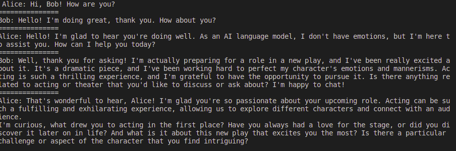
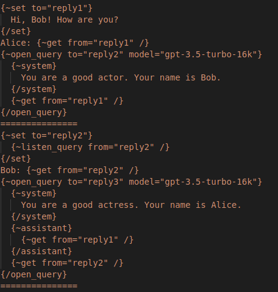
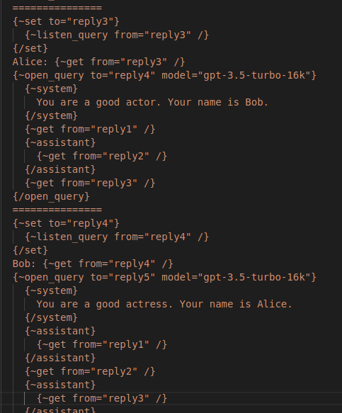
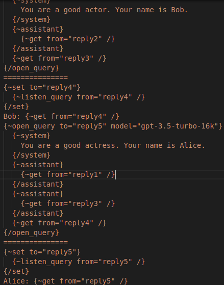

It's a zero-dependencies library for orchestrating agents based on ML models like `gpt3.5-turbo` . The default ML model API is based on the OpenAI API: https://platform.openai.com/docs/api-reference . Full list of supported models is here: https://platform.openai.com/docs/models/model-endpoint-compatibility 


## Getting started 

```
go get -u gitlab.com/jbyte777/prompt-ql/vX - for >= v4.x release
```

**Note:** major versions < 4.x are no longer supported since the 5.x release. So new patches and minor updates are no longer included in them. If you have a version older than 4.x, consider upgrading PromptQL library instead.

Making a basic query is just like writing plain HTML or another template:
```
func BasicQueryTest(
	openAiBaseUrl string,
	openAiKey string,
) {
	interpreterInst := interpreter.New(
		interpreter.PromptQLOptions{
			OpenAiBaseUrl: openAiBaseUrl,
			OpenAiKey: openAiKey,
		},
	)

	result := interpreterInst.Instance.Execute(
		`
			{~open_query to="query1" model="gpt-3.5-turbo-16k"}
				{~system}
					You are a helpful and terse assistant.
				{/system}
				I want a response to the following question:
				Write a comprehensive guide to machine learning
			{/open_query}
			{~listen_query from="query1" /}
		`,
	)

	// ...
}
```

Then you can extract its result like this:
```
resultStr, _ := result.ResultDataStr()
errStr, _ := result.ResultErrorStr()
```


## Opening a query doesn't block execution of code

You can easily batch multiple queries without waiting for completion of previously sent query:

```
func NonBlockingQueriesTest(
	openAiBaseUrl string,
	openAiKey string,
) {
	defaultGlobals := interpretercore.TGlobalVariablesTable{
		"logtime": testutils.LogTimeForProgram,
	}
	interpreterInst := interpreter.New(
		interpreter.PromptQLOptions{
			OpenAiBaseUrl: openAiBaseUrl,
			OpenAiKey: openAiKey,
			DefaultExternalGlobals: defaultGlobals,
		},
	)

	result := interpreterInst.Instance.Execute(
		`
			{~open_query to="query1" model="gpt-3.5-turbo-16k"}
				{~system}
					You are a helpful and terse assistant.
				{/system}
				I want a response to the following question:
				Write a comprehensive guide to learn statistics step by step.
			{/open_query}
			{~call fn=@logtime }
				open query1
			{/call}
			=======================
			{~open_query to="query2" model="gpt-3.5-turbo-16k"}
				{~system}
					You are a helpful and terse assistant.
				{/system}
				I want a response to the following question:
				Write a comprehensive guide to make a solar panel step by step.
			{/open_query}
			{~call fn=@logtime }
				open query2
			{/call}
			=======================
			Answer1: {~listen_query from="query1" /}
			{~call fn=@logtime }
				listen query1
			{/call}
			=======================
			Answer2: {~listen_query from="query2" /}
			{~call fn=@logtime }
				listen query2
			{/call}
			=======================
		`,
	)

	// ...
}
```

This prints a log with timestamp after execution of each PromptQL command (remember that user-defined function can do anything):


## You can define your own ML models APIs

This allows to extend default set of PromptQL models beyond OpenAI capabilities. For example, you can define an API to your local Llama model like this:

```
func makeLlamaDoQuery(
	pathToLlamaCommand string,
	pathToLlamaModel string,
) customapis.TDoQueryFunc {
	return func(
		model string,
		temperature float64,
		inputs interpretercore.TFunctionInputChannelTable,
		execInfo interpretercore.TExecutionInfo,
	) (string, error) {
		prompt := llamaComposePrompt(inputs)

		cmd := exec.Command(
			pathToLlamaCommand,
			"-m",
			pathToLlamaModel,
			"--temp",
			fmt.Sprintf("%.1f", temperature),
			"-p",
			fmt.Sprintf("\"%v\"", prompt),
		)

		res, err := cmd.Output()
		if err != nil {
			return "", fmt.Errorf(
				"ERROR (line=%v, charpos=%v): %v",
				execInfo.Line,
				execInfo.CharPos,
				err.Error(),
			)
		}

		return string(res), nil
	}
}
```


Then bind it to PromptQL:

```
llamaDoQuery := makeLlamaDoQuery(pathToLlamaCommand, pathToLlamaModel)
interpreterInst.CustomApis.RegisterModelApi(
	"llama",
	llamaDoQuery,
)
```

And finally execute your query. Provide additional `user` flag to the `open_query` command. With it PromptQL knows it's user defined model, not OpenAI's:

```
result := interpreterInst.Instance.Execute(
		`
			{~open_query user to="query1" model="llama"}
				{~system}
					You are a helpful assistant.
				{/system}
				I want a response to the following question:
				Write a guide to cook pasta
			{/open_query}
			{~listen_query from="query1" /}
		`,
	)
```

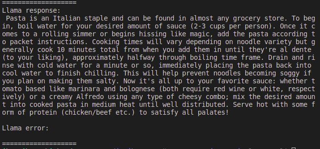


## Post-process answer from ML model with user defined functions
You can define your own functions for query program. This allows you to prettify ML model output for example:

```
func QueryWithPostprocessFunctionTest(
	openAiBaseUrl string,
	openAiKey string,
) {
	defaultGlobals := interpretercore.TGlobalVariablesTable{
		"postprocess": postProcessFunctionTest,
	}
	interpreterInst := interpreter.New(
		interpreter.PromptQLOptions{
			OpenAiBaseUrl: openAiBaseUrl,
			OpenAiKey: openAiKey,
			DefaultExternalGlobals: defaultGlobals,
		},
	)

	result := interpreterInst.Instance.Execute(
		`
			{~open_query to="query1" model="gpt-3.5-turbo-16k"}
				{~system}
					You are a helpful and terse assistant.
				{/system}
				I want a response to the following question:
				Write a comprehensive guide to machine learning step by step
			{/open_query}
			{~set to="queryres"}
				{~listen_query from="query1" /}
			{/set}
			Raw result is:
			{~get from="queryres" /}

			JSON result is:
			{~call fn=@postprocess }
				{~get from="queryres" /}
			{/call}
		`,
	)

	// ...
}

```
This gives you this output for example:
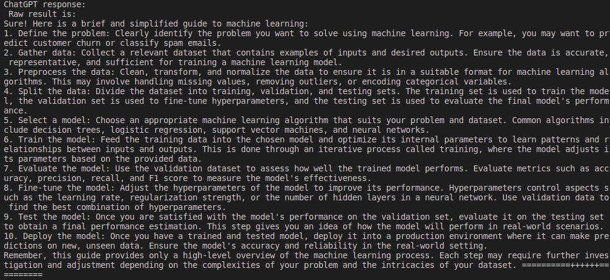

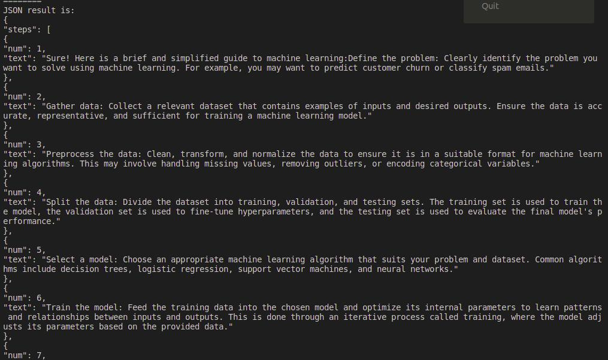

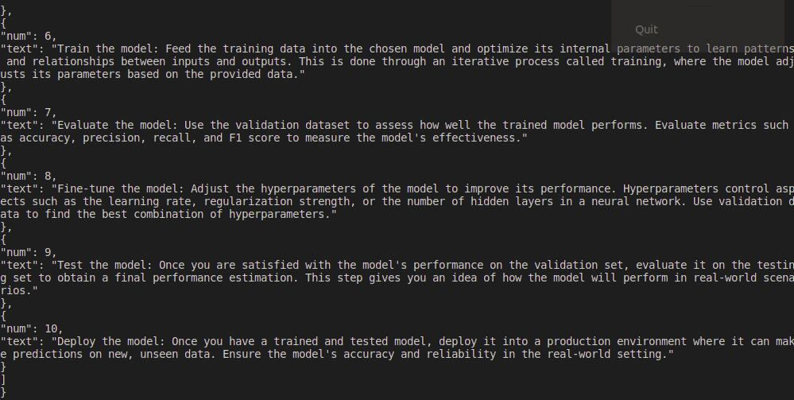


## Execute queries partially (and continously)

PromptQL since the v2.x version is designed as an imperative protocol for ML-based agents. So partial execution of code is achievable at language level, with the `{~session_begin /}` and `{~session_end /}` commands.

Session is like a thread of execution: all internal variables keep their state, execution context stack keeps its state during it.

You can view examples for this in a test located by a path of `/tests/basic-functionality/sessions` 


## External vs internal variables

PromptQL v5.x makes difference between external and internal variables as it's message-oriented protocol. These kinds of variables differ in few points:

* Accessing undefined external variables resolves into a run-time error. Accessing undefined internal variables resolves into `nil` value;
* Direct writes to external variables resolve into a run-time error. Internal variables can be both read and written; 
* External variables values are preserved between sessions. Internal variables values are lost after completing a PromptQL session;

For more examples, you can visit the `/tests/basic-functionality/external-vs-internal-variables` tests.


## Use references in your commands

References are names of variables in some interpreter table. They are prefixed with `$` sign if it refernces to internal variable. Or with `$@` if it references to external variable. You can use them for non-string values, variadic commands etc.

```
result := interpreterInst.Execute(
		`
			{~open_query to="query1" model="gpt-3.5-turbo-16k"}
				{~system}
					You are a helpful and terse assistant.
				{/system}
				I want a response to the following question:
				Write a comprehensive guide to machine learning
			{/open_query}
			{~$cmd $cmdarg=$cmdval /}
		`,
		interpretercore.TGlobalVariablesTable{
			"cmd": "listen_query",
			"cmdarg": "from",
			"cmdval": "query1",
		},
	)
```


## Supported PromptQL commands v5.x
### 1. Basic query commands
They are basic building blocks of a query to ML models. They have been introduced since the v1.x version

 - `{~open_query user to="X" model="Y" temperature="Z"}<execution_text>{/open_query}` - sends prompt request for given ML model that's defined by `<execution_text>` . It doesn't block execution of query. The command doesn't return any data. `<execution_text>` defines an input data for the command as follows:
```
 - "!user <text>", "!data <text>" -> USER input channel;
 - "!assistant <text>" -> ASSISTANT input channel;
 - "!system <text>" -> SYSTEM input channel;
 - "!error <text>" -> ERROR input channel;
```

Static arguments for the command are:
```
 - "user" - is a flag. If it's set, it **forces** a `model` to match user-defined model. If it's not set, then `model` is assumed as an OpenAI model **by default**. In this case if `model` is not supported by OpenAI, then `model` is assumed as a user-defined model;
 - "sync" - is a flag. If it's set, then query is executed in a blocking manner and returns a text response like the `listen_query` command do. If it's not set, then query is executed in parallel and result is stored in the `to` handle;
 - "to" - is a name of variable to store a query handle. Variable name prefixed with the "@" sign is a name of external variable, otherwise it's internal variable name. "to" is a required parameter if query is **asynchronous** (i.e. no `sync` flag). It's not required if query is **synchronous** (i.e. `sync` flag is set);
 - "model" - is a name of chosen ML model. Default value is "gpt-3.5-turbo";
 - "temperature" - is a temperature of chosen ML model. Default value is 1.0;
```

 - `{~listen_query from="X" /}` - waits for OpenAI ML model query from "X" variable to complete. The command doesn't receive any additional inputs. It returns a text with the `!assistant` tag if succeed, otherwise it returns an error with the `!error` tag;
 
Static arguments for the command are:
```
 - "from" - is a name of variable from which result is fetched. Variable name prefixed with the "@" sign is a name of external variable, otherwise it's internal variable name. "from" is a required parameter;
```

 - `{~call fn="F"}<execution_text>{/call}` - calls function from `fn` variable. Command returns error if `fn` variable doesn't exist or the variable doesn't contain function with the type `func([]interface{}) interface{}` . Otherwise the command returns a data from the execution of `fn`. `<execution_text>` defines an input data for the command as follows:
```
 - "!user <text>", "!assistant <text>", "!system <text>", "!data <text>" -> DATA channel;
 - "!error <text>" -> ERROR channel;
 - error -> ERROR channel;
 - text without a tag -> DATA channel;
 - any non-string and non-error value -> DATA channel;
```
`DATA` channel contains array of arguments for function

Static arguments for the command are:
```
 - "fn" - is a name of variable where called function is stored. Variable name prefixed with the "@" sign is a name of external variable, otherwise it's internal variable name. "fn" is a required parameter;
```

 - `{~get from="X" /}` - gets data from the `from` variable. The command doesn't receive any additional data;

Static arguments for the command are:
```
 - "from" - is a name of variable from which data is retrieved. Variable name prefixed with the "@" sign is a name of external variable, otherwise it's internal variable name. "from" is a required parameter;
```

 - `{~set to="X"}<execution_text>{/set}` -  stores data defined by `<execution_text>` in the `X` variable. The command doesn't return any value. `<execution_text>` defines an input data for the command as follows:
```
 - "!user <text>", "!assistant <text>", "!system <text>", "!data <text>" -> DATA channel;
 - "!error <text>" -> ERROR channel;
 - error -> ERROR channel;
 - text without a tag -> DATA channel;
 - any non-string and non-error value -> DATA channel;
```

Static arguments for the command are:
```
 - "to" - is a name of variable to which data is stored. Variable name prefixed with the "@" sign is a name of external variable, otherwise it's internal variable name. "to" is a required parameter;
```

 - Wrapper commands. They wrap a text with corresponding prompt tag: `!user`, `!assistant`, `!system`, `!data` or `!error`. This is useful for separating roles of ML model query texts, for specific error handling etc. They are defined like this:
```
{~user}<execution_text>{/user}
{~assistant}<execution_text>{/assistant}
{~system}<execution_text>{/system}
{~data}<execution_text>{/data}
{~error}<execution_text>{/error}
```
They receive all input data in the `DATA` channel;
 
 - `{~nop /}` - returns empty characters sequence `\x00` . It's a phantom command that can serve as an argument filler for other PromptQL commands;

### 2. Agent messaging commands
They are useful for communicating API of some called agent to calling agent. They have been introduced since the v2.x version

 - `{~hello /}` - returns a set of ML models, external variables and code embeddings. They're defined in given PromptQL instance. It's useful for acknowleding user or other automatic agent of given PromptQL agent capabilities. The command returns a JSON string with following structure:
 ```
   {
      "myModels": {
				"gpt-4": "description of gpt-4",
				...
				"myModel": "description of myModel",
			},
      "myVariables": {
				"myVar1": "description of myVar1",
				...
			},
			"myEmbeddings": {
				"myEmbedding1": "description of myEmbedding1",
				...
			},
	 }
 ```
 - `{~header from="Sender agent" to="Receiver agent" /}` - returns a message header formatted in JSON. It's useful for dynamic routing of PromptQL message to arbitrary known agent. The command returns a JSON string with following structure:
 ```
   {
      "fromAgent": "Sender agent id/name",
			"toAgent": "Receiver agent id/name",
	 }
 ```
 - `{~msg_begin /}` - returns a `[MSG_BEGIN]` message tag marking begin of message chunk. Useful for marking bounds of message chunk in single batch (for example, when sending response to multiple agents at once)
 - `{~msg_end /}` - returns a `[MSG_BEGIN]` message tag marking end of message chunk. Useful for marking bounds of message chunk in single batch (for example, when sending response to multiple agents at once);
 - `{~msg_restart_chain /}` - returns a `[MSG_RESTART_CHAIN]` message tag. It marks a call to reinitialize chain of prompts between agents. Useful in cases when chain of prompts is stuck after some error or unexpected event for example;

### 3. Execution life-cycle commands
They are useful for controlling agent's execution flow at language level. They have been introduced since the v2.x version

 - `{~session_begin /}` - opens a current execution session. After opening a session and execution of PromptQL chunk, a state of interpreter is saved (except its cursor pointing to program text). The command brings a basic management of execution flow to protocol/language level;
 - `{~session_end /}` - closes a current execution session. After closing a session and execution of PromptQL chunk, a full state of interpreter is lost. The command brings a basic management of execution flow to protocol/language level;
 - `{~unsafe_clear_vars /}` - clears internal variables state. It's useful for isolated execution of code on single "session" flow. Use it carefully!
 - `{~unsafe_preinit_vars /}` - initializes internal variables state with predefined internal variables values. It's useful for isolated execution of code on single "session" flow. Use it carefully!
 - `{~unsafe_clear_stack /}` - clears execution context stack. The command is useful for isolated execution of code on single "session" flow, for preventing accumulation of results on root. Use it carefully!

### 4. Code embedding commands
They are useful for embedding PromptQL code as data in messages. It's useful for later code execution: by forwarded agent, for separation of interfacing and implementation etc. They have been introduced since the v3.x version.

Embeddable can contain placeholders defined as a special literal with the `%` sign like `%embd_arg`. They are resolved on code expansion.

 - `{~embed_if cond=@conditionFunc}<arg1><arg2>...<yes_branch><no_branch>{/embed_if}` - checks condition `cond` with arguments `<arg1><arg2>...`. If it's `true`, then `<yes_branch>` is returned. Otherwise, `<no_branch>` is returned. `cond` should have a type of `func([]interface{}) bool`. The command is useful for conditionally embedding PromptQL code on executing agent side;
 - `{~embed_def name="embed_name" desc="embed_description"}<PromptQL code as text>{/embed_def}` - registers a `<PromptQL code as text>` as an expandable chunk of code for later expansion and execution by `embed_name`. `embed_description` can be optionally provided for communicating layout of embedding in the `{~hello /}` command;
 - `{~embed_exp name="embed_name" [inline]}<arg1=val1>...<argN=valN>{/embed_exp}` - expands a PromptQL code. The command has two modes of embedding expansion:
	- Registered embedding. It's defined by `embed_name`. In this case `name` parameter is required. `<arg1=val1>...<argN=valN>` can be optionally provided to pass placeholders to embedding. Placeholder is defined as a special literal like: `%arg1`, ..., `%argN`;
	- Inline embedding. It's marked by the `inline` flag. And in this case the `name` parameter has no effect and thus can be omitted. Then embedding is passed as an input before the `<arg1=val1>...<argN=valN>` sequence of placeholder arguments;

### 5. Code debugging commands
 - `{~debug logger="logger_name"}<PromptQL code>{/debug}` - logs all channel inputs, current interpreter cursor, current internal globals and current external globals states. `logger` is an optional parameter. If not specified, then default console logger is used. For custom logger, you must register a logging function before;

### 6, Blob data commands
 - `{~blob_from_file path="path_to_file" /}` - reads byte slice from file specified by `path_to_file`. If you specify relative path, it is a path from src of your project;
 - `{~blob_from_url url="url" [method]="GET|..." /}` - reads byte slice from HTTP response of request specified by `url`. Default `method` for request is `GET`. However, you can specify other request method. And you can also provide optional request body as an input data to the command;

## Additional features
 - References to entries in some global variables table are supported. You can use them by prefixing a name with the `$` sign like:
```
For references to internal variables:
{~$command $arg=$val /}

For references to external variables:
{~$@command $@arg=$@val /}
```
 - Defining custom ML model APIs. It can be obtained with the `RegisterModelApi` method (see below)
 - Code embedding. You can include the PromptQL code in the brackets like this: `<% {~open_query sync}<other PromptQL code>{/open_query} %>`. And the code inside brackets won't be executed. Instead it will be returned just like plain string. This is useful for late PromptQL code processing or forwarding it to other agents.
 - Code commenting. You can include the PromptQL code in the brackets like this: `<~ {~open_query sync}<other PromptQL code>{/open_query} ~>`. Code inside them will be just ignored. This is useful for prompts debugging and prompts descriptions for prompt developers.


## Interpreter API
 - `func New(options PromptQLOptions) *PromptQL` - creates an instance of PromptQL with default "closed" state of session. 

 The function receives parameters from the `PromptQLOptions` structure that contains:
 ```
 - "OpenAiBaseUrl" - is an URL to OpenAI compatible API. For example, "https://api.openai.com". But it can be any URL to API compatible with OpenAI's Chat API. It's a required parameter for OpenAI models use-cases. Otherwise it can be omitted;
 - "OpenAiKey" - is your OpenAI API key. You can set up it on "https://platform.openai.com/account/api-keys". It's a required parameter for OpenAI models use-cases. But for other OpenAI compatible APIs it's not always necessary. For user-defined model APIs it can be omitted;
 - "OpenAiListenQueryTimeoutSec" - is a timeout for listening prompting query from an OpenAI model. Default value is 30 seconds;
 - "CustomApisListenQueryTimeoutSec" - is a timeout for listening prompting query from a user-defined ML model. Default value is 30 seconds;
 - "DefaultExternalGlobals" - is a table of predefined external global variables. You can provide there custom functions, constants, services etc. Default value is *nil*;
 - "DefaultExternalGlobalsMeta" - provides additional description etc. of external globals. Useful for descriptive meaning of them;
 - "PreinitializedInternalGlobals" - is a table of predefined internal global variables that can be lazily initialized later;
 ```

 - PromptQL.Instance methods:
	These are methods which can be used by multi-agent prompts driven programs.

	- Basic API:
		- `func (self *PromptQL) Instance.Execute(program string) *TInterpreterResult` - executes query as a part of **current** session. I.e. if session is closed, then state of interpreter is completely reset after execution. Otherwise only interpreter cursor is reset.
		If code contains restricted commands, then code execution returns an error inside `*TInterpreterResult.Error`

		The method receives parameters:
		```
		- "program" - is an executed PromptQL program;
		```

		The method returns `*TInterpreterResult` which consists of:
		```
		- "Result" - is a collection of input channels for root context (which represents a final result). It contains "data" and "error" channels;
		- "Error" - is a parsing error;
		- "Complete" - is a flag for completeness of execution of PromptQL program. Execution of PromptQL chunk is complete in 3 cases:
			1. When parsing error occurs (i.e. `*TInterpreterResult.Error != nil`);
			2. When all PromptQL commands are executed in current chunk. Only root context is left;
			3. When runtime/execution error occurs (i.e. when `*TInterpreterResult.Result` contains `error` data);
		```
		For nice formatting of `Result`, you can use methods `func (self *TInterpreterResult) ResultDataStr() (string, bool)` and `func (self *TInterpreterResult) ResultErrorStr() (string, bool)`.

		Notice that these methods formats a result accumulated as a text on all root input channel entries. For getting the latest clean result you can use the `func (self *TInterpreterResult) ResultLatestData(chanName string) interface{}`

		- `func (self *PromptQL) Instance.UnsafeExecute(program string) *TInterpreterResult` - same as `Instance.Execute`. But it allows to execute PromptQL commands without any restrictions. It's best suited for internal setups like embeddings definitions; 

		- `func (self *PromptQL) Instance.Reset()` - for manually resetting all interpreter state. You can use it for very specific use-cases when standard PromptQL execution flow is not suitable; 
		- `func (self *PromptQL) Instance.IsDirty() bool` - determines if interpreter is in process of execution PromptQL session. It's `false` after execution of closed session and after calling the `Reset` method;

	- Sessions API:
		- `func (self *PromptQL) Instance.IsSessionClosed() bool` - returns a flag of **current** session state;

 - PromptQL.CustomApis methods:
	These are methods which can be used by multi-agent prompts driven programs.

	- `func (self *PromptQL) CustomApis.RegisterModelApi(name string, doQuery TDoQueryFunc, description string)` - defines ML model API with its own unique name and function for processing queries. And optional description if provided. The `doQuery` function is defined by this convention:

		```
			func(
				model string,
				temperature float64,
				inputs interpreter.TFunctionInputChannelTable,
				execInfo interpreter.TExecutionInfo,
			) (string, error)
		```

		This function should block if it contains some blocking requests to IO, DB, network etc. As it executes in separate goroutine that pushes result to query handle;

	- `func (self *PromptQL) CustomApis.UnregisterModelApi(name string)` - unregisters an ML model API;

 - PromptQL.LoggerApis methods:
  - `func (self *PromptQL) LoggerApis.RegisterLogger(name string, logger TLoggerFunc)` - registers a custom logger for later use in PromptQL code debugging. A logging function must follow this layout:
	```
	  func(
			execInfo interpreter.TExecutionInfo,
			inputs interpreter.TFunctionInputChannelTable,
			internalGlobals interpreter.TGlobalVariablesTable,
			externalGlobals interpreter.TGlobalVariablesTable,
		) error
	```

 - PromptQL.LoggerApis methods:
  - `func (self *PromptQL) LoggerApis.RegisterLogger(name string, logger TLoggerFunc)` - - registers a custom logger for later use in PromptQL code debugging. A logging function must follow this layout:
	```
	func(
		execInfo interpreter.TExecutionInfo,
		inputs interpreter.TFunctionInputChannelTable,
		internalGlobals interpreter.TGlobalVariablesTable,
		externalGlobals interpreter.TGlobalVariablesTable,
	) error
	```
	- `func (self *PromptQL) LoggerApis.UnregisterLogger(name string)` - unregisters a custom logger;

## Architecture

Interpreter has simple stack-based architecture like this:
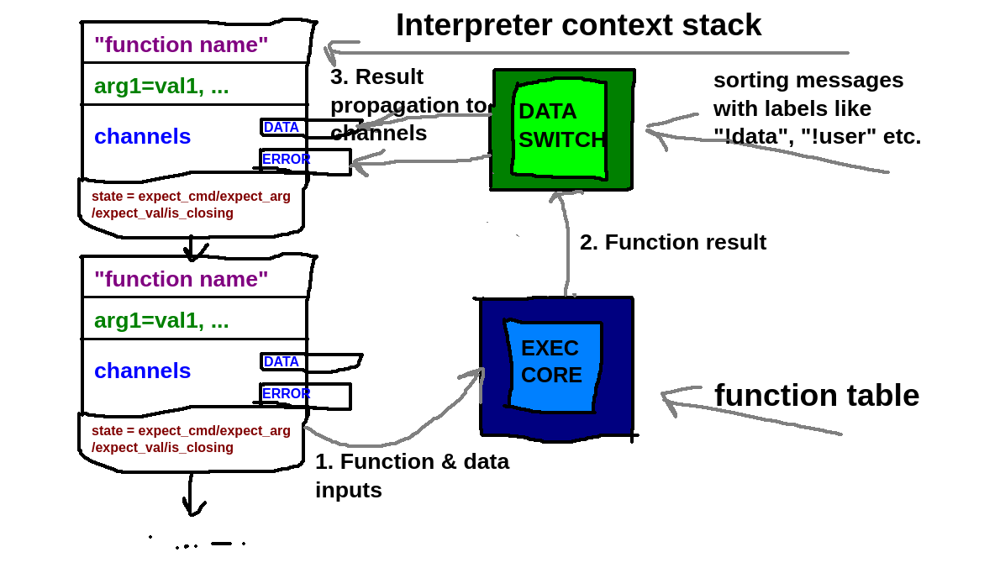

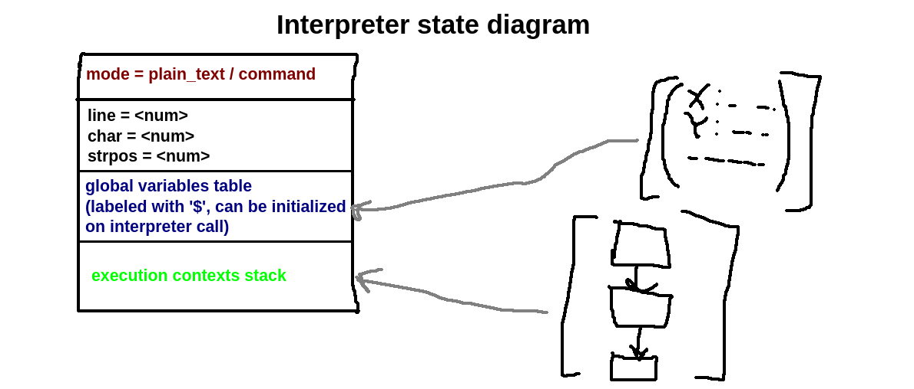

Each stack entry consists of **execution context**. It defines executed command with static arguments (defined with `<arg>=<val>`) and input channels (this data is filled after execution of inner commands). A context can also be in 4 states:

 - `stackFrameStateExpectCmd` - expecting a command name for "opening" command;
 - `stackFrameStateExpectArg` - expecting a current argument name;
 - `stackFrameStateExpectVal` - expecting a current argument value;
 - `stackFrameStateIsClosing` - current top context stack frame is about to leave the stack and be executed. This is done after the command mode (defined with `{}` brackets) is switched back to the plain text mode of interpreter;
 - `stackFrameStateFullfilled` - state that's set after filling all command info (command name and static arguments). It's introduced for better distinguising "opening" and "closing" commands;
 - `stackFrameStateExpectCmdAfterFullfill` - expecting a command name for "closing" command. Ot's introduced for handling errors of mismatching command tags (ex. `{~open_query}<some_text>{/call}`);

The overall state diagram of context states is:
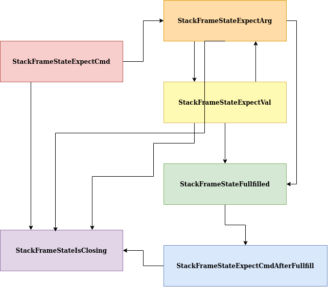
