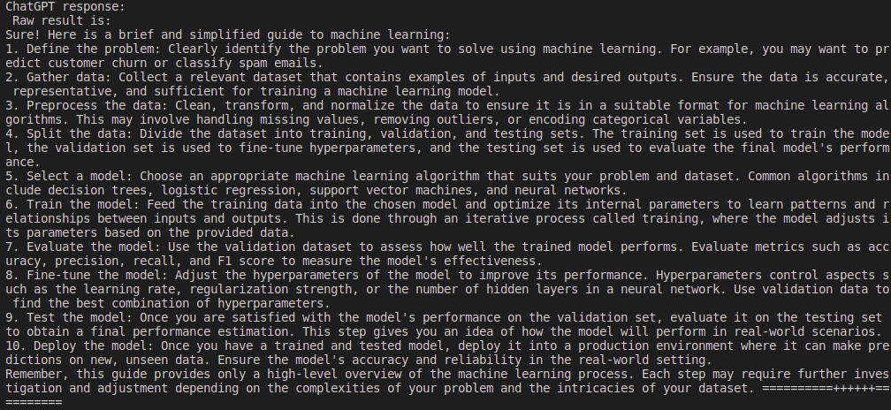
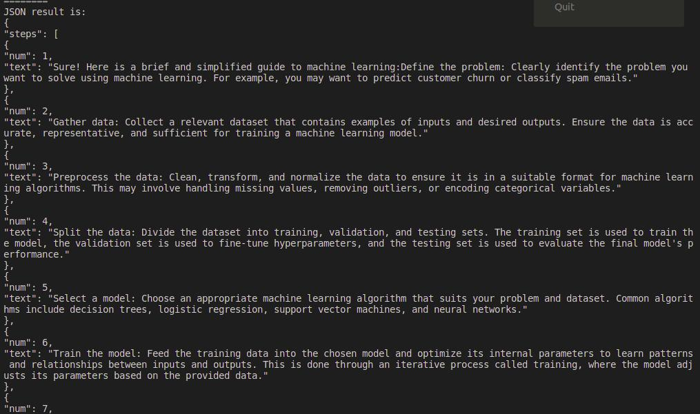
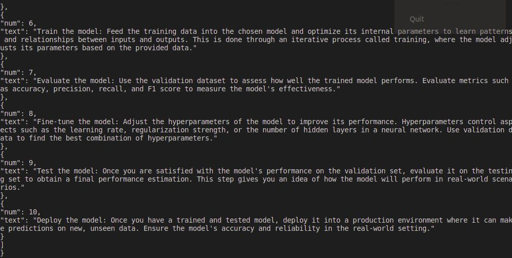
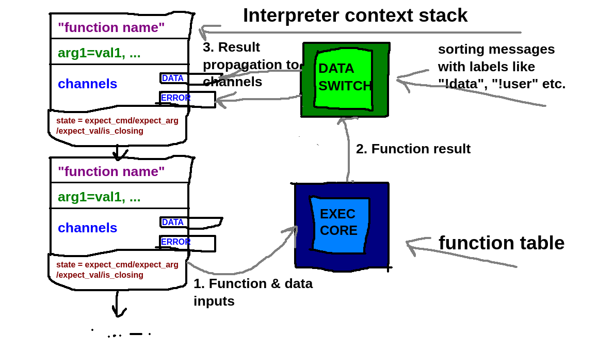
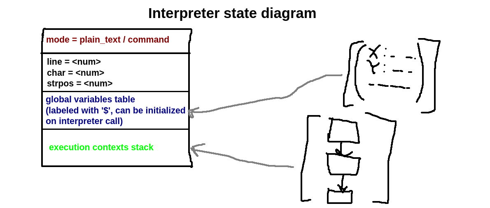

# PromptQL: Simple and flexible query language for large language models
It's a zero-dependencies library for making queries for LLM models like `gpt3.5-turbo` . It's based on the OpenAI API: https://platform.openai.com/docs/api-reference . Full list of supported models is here: https://platform.openai.com/docs/models/model-endpoint-compatibility


## Getting started
```
go get -u gitlab.com/jbyte777/prompt-ql
```


Making a basic query is just like writing plain HTML or another template:
```
import (
	"fmt"

	interpreter "gitlab.com/jbyte777/prompt-ql/interpreter"
)

func BasicQueryTest(
	openAiBaseUrl string,
	openAiKey string,
) {
	interpreterInst := interpreter.New(
		openAiBaseUrl,
		openAiKey,
	)

	result := interpreterInst.Execute(
		`
			{~open_query to="query1" model="gpt-3.5-turbo-16k"}
				{~system}
					You are a helpful and terse assistant.
				{/system}
				I want a response to the following question:
				Write a comprehensive guide to machine learning
			{/open_query}
			{~listen_query from="query1" /}
		`,
		nil,
	)
}
	// ...
```

Then you can extract its result like this:
```
resultStr, _ := result.ResultDataStr()
errStr, _ := result.ResultErrorStr()
```

## Post-process answer from LLM with user defined functions
You can define your own functions for query program. This allows you to prettify LLM output for example:
```
import (
	"fmt"

	interpretercore "gitlab.com/jbyte777/prompt-ql/core"
	interpreter "gitlab.com/jbyte777/prompt-ql/interpreter"
)

func QueryWithPostprocessFunctionTest(
	openAiBaseUrl string,
	openAiKey string,
) {
	interpreterInst := interpreter.New(
		openAiBaseUrl,
		openAiKey,
	)

	result := interpreterInst.Execute(
		`
			{~open_query to="query1" model="gpt-3.5-turbo-16k"}
				{~system}
					You are a helpful and terse assistant.
				{/system}
				I want a response to the following question:
				Write a comprehensive guide to machine learning step by step
			{/open_query}
			{~set to="queryres"}
				{~listen_query from="query1" /}
			{/set}
			Raw result is:
			{~get from="queryres" /}

			JSON result is:
			{~call fn="postprocess"}
				{~get from="queryres" /}
			{/call}
		`,
		interpretercore.TGlobalVariablesTable{
			"postprocess": postProcessFunctionTest,
		},
	)

	if result.Error != nil {
		panic(result.Error)
	}

	fmt.Println("===================")
	resultStr, _ := result.ResultDataStr()
	errStr, _ := result.ResultErrorStr()
	fmt.Printf(
		"ChatGPT response:\n%v\n",
		resultStr,
	)
	fmt.Printf(
		"ChatGPT error:\n%v\n",
		errStr,
	)
	fmt.Println("===================")
}

```
This gives you this output for example:






## Execute non-complete queries

What if a query is sent over the network, it's sent in unfinished chunks  and you need to save space? The PromptQL library can also handle this case! Just like with SSR rendered HTML that is split into chunks:
```
import (
	"fmt"
	"time"

	interpretercore "gitlab.com/jbyte777/prompt-ql/core"
	interpreter "gitlab.com/jbyte777/prompt-ql/interpreter"
)

func PartialExecutionTest(
	openAiBaseUrl string,
	openAiKey string,
) {
	interpreterInst := interpreter.New(
		openAiBaseUrl,
		openAiKey,
	)

	result := interpreterInst.ExecutePartial(
		`
			{~open_query to="query1" model="gpt-3.5-turbo-16k"}
				{~system}
					You are a helpful and terse assistant.
				{/system}
				I want a response to the following question:
				Write a comprehensive guide to machine learning step by step
		`,
		interpretercore.TGlobalVariablesTable{
			"postprocess": postProcessFunctionTest,
		},
	)

        // Simulate network, DB load etc.
	time.Sleep(3 * time.Second)

	result = interpreterInst.ExecutePartial(
		`
			{/open_query}
			{~set to="queryres"}
				{~listen_query from="query1" /}
			{/set}
			Raw result is:
			{~get from="queryres" /}

			JSON result is:
			{~call fn="postprocess"}
				{~get from="queryres" /}
			{/call}
		`,
		interpretercore.TGlobalVariablesTable{
			"postprocess": postProcessFunctionTest,
		},
	)

	if result.Error != nil {
		panic(result.Error)
	}

	fmt.Println("===================")
	resultStr, _ := result.ResultDataStr()
	errStr, _ := result.ResultErrorStr()
	fmt.Printf(
		"ChatGPT response:\n%v\n",
		resultStr,
	)
	fmt.Printf(
		"ChatGPT error:\n%v\n",
		errStr,
	)
	fmt.Println("===================")
}
```

## Use wildcards in your commands

Wildcards are names of variables in interpreter table. They are prefixed with `$` sign. You can use them for non-string values, variadic commands etc.

```
result := interpreterInst.Execute(
		`
			{~open_query to="query1" model="gpt-3.5-turbo-16k"}
				{~system}
					You are a helpful and terse assistant.
				{/system}
				I want a response to the following question:
				Write a comprehensive guide to machine learning
			{/open_query}
			{~$cmd $cmdarg=$cmdval /}
		`,
		interpretercore.TGlobalVariablesTable{
			"cmd": "listen_query",
			"cmdarg": "from",
			"cmdval": "query1",
		},
	)
```

## Supported PromptQL commands v1.0

 - `{~open_query to="X" model="Y" temperature="Z"}<execution_text>{/open_query}` - sends prompt request for given LLM that's defined by `<execution_text>` . It doesn't block execution of query. The command doesn't return any data. `<execution_text>` defines an input data for the command as follows:
```
 - "!user <text>", "!data <text>" -> USER input channel;
 - "!assistant <text>" -> ASSISTANT input channel;
 - "!system <text>" -> SYSTEM input channel;
 - "!error <text>" -> ERROR input channel;
```
 - `{~listen_query from="X" /}` - waits for OpenAI LLM query from "X" variable to complete. It doesn't receive any additional inputs. It returns a text with the `!assistant` tag if succeed, otherwise it returns an error with the `!error` tag;
 - `{~call fn="F"}<execution_text>{/call}` - calls function from `fn` variable. Command returns error if `fn` variable doesn't exist or the variable doesn't contain function with the type `func([]interface{}) interface{}` . Otherwise the command returns a data from the execution of `fn`. `<execution_text>` defines an input data for the command as follows:
```
 - "!user <text>", "!assistant <text>", "!system <text>", "!data <text>" -> DATA channel;
 - "!error <text>" -> ERROR channel;
 - error -> ERROR channel;
 - text without a tag -> DATA channel;
 - any non-string and non-error value -> DATA channel;
```
`DATA` channel contains array of arguments for function
 - `{~get from="X" /}` - gets data from the `from` variable. The command doesn't receive any additional data;
 - `{~set to="X"}<execution_text>{/set}` -  stores data defined by `<execution_text>` in the `X` variable. The command doesn't return any value. `<execution_text>` defines an input data for the command as follows:
```
 - "!user <text>", "!assistant <text>", "!system <text>", "!data <text>" -> DATA channel;
 - "!error <text>" -> ERROR channel;
 - error -> ERROR channel;
 - text without a tag -> DATA channel;
 - any non-string and non-error value -> DATA channel;
```
 - Wrapper commands. They wrap a text with corresponding prompt tag: `!user`, `!assistant`, `!system`, `!data` or `!error`. This is useful for separating roles of LLM query texts, for specific error handling etc. They are defined like this:
```
{~user}<execution_text>{/user}
{~assistant}<execution_text>{/assistant}
{~system}<execution_text>{/system}
{~data}<execution_text>{/data}
{~error}<execution_text>{/error}
```
They receive all input data in the `DATA` channel;

## Additional features
 - References to entries in global variables table (or "wildcards") are supported. You can use them by prefixing a name with the `$` sign like:
```
{~$command $arg=$val /}
```

## Interpreter API

 - `func (self *Interpreter) Execute(program string, globalVars TGlobalVariablesTable) *TInterpreterResult` - executes query as a complete chunk. I.e. the state of interpreter is completely reset after execution. `globalVars` are additional variables for the query;
 - `func (self *Interpreter) ExecutePartial(program string, globalVars TGlobalVariablesTable) *TInterpreterResult` - executes query as an uncomplete chunk. Only interpreter cursor is reset. `globalVars` are additional variables for the query;
 - `func (self *Interpreter) Reset()` - for manually resetting all interpreter state. It can be combined with partial execution;
 - `func (self *Interpreter) IsDirty() bool` - determines if interpreter is in progress of execution query chunks. It's `false` after execution of `Execute` and `Reset` methods;

## Architecture

Interpreter has simple stack-based architecture like this:




Each stack entry consists of **execution context**. It defines executed command with static arguments (defined with `<arg>=<val>`) and input channels (this data is propagated with previously executed command). A context can also be in 4 states:

 - `StackFrameStateExpectCmd` - expecting a command name;
 - `StackFrameStateExpectArg` - expecting a current argument name;
 - `StackFrameStateExpectVal` - expecting a current argument value;
 - `StackFrameStateIsClosing` - current top context stack frame is about to leave the stack and be executed. This is done after the command mode (defined with `{}` brackets) is switched back to the plain text mode of interpreter;
