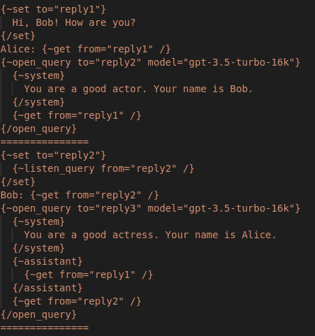
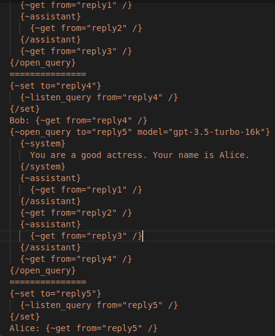

# PromptQL: Simple and flexible query language for large language models






It's a zero-dependencies library for making queries for LLM models like `gpt3.5-turbo` . It's based on the OpenAI API: https://platform.openai.com/docs/api-reference . Full list of supported models is here: https://platform.openai.com/docs/models/model-endpoint-compatibility 

## Getting started
```
go get -u gitlab.com/jbyte777/prompt-ql
```


Making a basic query is just like writing plain HTML or another template:
```
import (
	"fmt"

	interpreter "gitlab.com/jbyte777/prompt-ql/interpreter"
)

func BasicQueryTest(
	openAiBaseUrl string,
	openAiKey string,
) {
	interpreterInst := interpreter.New(
		openAiBaseUrl,
		openAiKey,
		0,
		0,
	)

	result := interpreterInst.Instance.Execute(
		`
			{~open_query to="query1" model="gpt-3.5-turbo-16k"}
				{~system}
					You are a helpful and terse assistant.
				{/system}
				I want a response to the following question:
				Write a comprehensive guide to machine learning
			{/open_query}
			{~listen_query from="query1" /}
		`,
		nil,
	)

	// ...
}
```

Then you can extract its result like this:
```
resultStr, _ := result.ResultDataStr()
errStr, _ := result.ResultErrorStr()
```


## Opening a query doesn't block execution of code

You can easily batch multiple queries without waiting for completion of previously sent query:

```
func logTimeForProgram(args []interface{}) interface{} {
	if len(args) < 1 {
		return ""
	}

	log, isLogStr := args[0].(string)
	if !isLogStr {
		return ""
	}

	fmt.Printf(
		"[%v] %v",
		timeutils.NowTimestamp(),
		log,
	)

	return ""
}

func NonBlockingQueriesTest(
	openAiBaseUrl string,
	openAiKey string,
) {
	// ...

	result := interpreterInst.Instance.Execute(
		`
			{~open_query to="query1" model="gpt-3.5-turbo-16k"}
				{~system}
					You are a helpful and terse assistant.
				{/system}
				I want a response to the following question:
				Write a comprehensive guide to learn statistics step by step.
			{/open_query}
			{~call fn="logtime"}
				open query1
			{/call}
			=======================
			{~open_query to="query2" model="gpt-3.5-turbo-16k"}
				{~system}
					You are a helpful and terse assistant.
				{/system}
				I want a response to the following question:
				Write a comprehensive guide to make a solar panel step by step.
			{/open_query}
			{~call fn="logtime"}
				open query2
			{/call}
			=======================
			Answer1: {~listen_query from="query1" /}
			{~call fn="logtime"}
				listen query1
			{/call}
			=======================
			Answer2: {~listen_query from="query2" /}
			{~call fn="logtime"}
				listen query2
			{/call}
			=======================
		`,
		interpretercore.TGlobalVariablesTable{
			"logtime": logTimeForProgram,
		},
	)

	// ...
}
```

This prints a log with timestamp after execution of each PromptQL command (remember that user-defined function can do anything):


## You can define your own LLM APIs

This allows to extend default LLM set of PromptQL beyond OpenAI capabilities. For example, you can define an API to your local Llama model like this:

```
func makeLlamaDoQuery(
	pathToLlamaCommand string,
	pathToLlamaModel string,
) customapis.TDoQueryFunc {
	return func(
		model string,
		temperature float64,
		inputs interpretercore.TFunctionInputChannelTable,
		execInfo interpretercore.TExecutionInfo,
	) (string, error) {
		prompt := llamaComposePrompt(inputs)

		cmd := exec.Command(
			pathToLlamaCommand,
			"-m",
			pathToLlamaModel,
			"--temp",
			fmt.Sprintf("%.1f", temperature),
			"-p",
			fmt.Sprintf("\"%v\"", prompt),
		)

		res, err := cmd.Output()
		if err != nil {
			return "", fmt.Errorf(
				"ERROR (line=%v, charpos=%v): %v",
				execInfo.Line,
				execInfo.CharPos,
				err.Error(),
			)
		}

		return string(res), nil
	}
}
```


Then bind it to PromptQL:

```
llamaDoQuery := makeLlamaDoQuery(pathToLlamaCommand, pathToLlamaModel)
interpreterInst.CustomApis.RegisterLLMApi(
	"llama",
	llamaDoQuery,
)
```

And finally execute your query. Provide additional `user` flag to the `open_query` command. With it PromptQL knows it's user defined model, not OpenAI's:

```
result := interpreterInst.Instance.Execute(
		`
			{~open_query user to="query1" model="llama"}
				{~system}
					You are a helpful assistant.
				{/system}
				I want a response to the following question:
				Write a guide to cook pasta
			{/open_query}
			{~listen_query from="query1" /}
		`,
		nil,
	)
```


## Post-process answer from LLM with user defined functions
You can define your own functions for query program. This allows you to prettify LLM output for example:
```
import (
	"fmt"

	interpretercore "gitlab.com/jbyte777/prompt-ql/core"
	interpreter "gitlab.com/jbyte777/prompt-ql/interpreter"
)

func QueryWithPostprocessFunctionTest(
	openAiBaseUrl string,
	openAiKey string,
) {
	// ...

	result := interpreterInst.Instance.Execute(
		`
			{~open_query to="query1" model="gpt-3.5-turbo-16k"}
				{~system}
					You are a helpful and terse assistant.
				{/system}
				I want a response to the following question:
				Write a comprehensive guide to machine learning step by step
			{/open_query}
			{~set to="queryres"}
				{~listen_query from="query1" /}
			{/set}
			Raw result is:
			{~get from="queryres" /}

			JSON result is:
			{~call fn="postprocess"}
				{~get from="queryres" /}
			{/call}
		`,
		interpretercore.TGlobalVariablesTable{
			"postprocess": postProcessFunctionTest,
		},
	)

	// ...
}

```
This gives you this output for example:


## Execute non-complete queries

What if a query is sent over the network, it's sent in unfinished chunks  and you need to save space? The PromptQL library can also handle this case! Just like with SSR rendered HTML that is split into chunks:
```
import (
	"fmt"
	"time"

	interpretercore "gitlab.com/jbyte777/prompt-ql/core"
	interpreter "gitlab.com/jbyte777/prompt-ql/interpreter"
)

func PartialExecutionTest(
	openAiBaseUrl string,
	openAiKey string,
) {
	// ...

	result := interpreterInst.Instance.ExecutePartial(
		`
			{~open_query to="query1" model="gpt-3.5-turbo-16k"}
				{~system}
					You are a helpful and terse assistant.
				{/system}
				I want a response to the following question:
				Write a comprehensive guide to machine learning step by step
		`,
		interpretercore.TGlobalVariablesTable{
			"postprocess": postProcessFunctionTest,
		},
	)

	// Emulate network, DB load etc...
	time.Sleep(3 * time.Second)

	result = interpreterInst.Instance.ExecutePartial(
		`
			{/open_query}
			{~set to="queryres"}
				{~listen_query from="query1" /}
			{/set}
			Raw result is:
			{~get from="queryres" /}
			==========================
			JSON result is:
			{~call fn="postprocess"}
				{~get from="queryres" /}
			{/call}
		`,
		interpretercore.TGlobalVariablesTable{
			"postprocess": postProcessFunctionTest,
		},
	)

	// ...
}
```


## Use wildcards in your commands

Wildcards are names of variables in interpreter table. They are prefixed with `$` sign. You can use them for non-string values, variadic commands etc.

```
result := interpreterInst.Execute(
		`
			{~open_query to="query1" model="gpt-3.5-turbo-16k"}
				{~system}
					You are a helpful and terse assistant.
				{/system}
				I want a response to the following question:
				Write a comprehensive guide to machine learning
			{/open_query}
			{~$cmd $cmdarg=$cmdval /}
		`,
		interpretercore.TGlobalVariablesTable{
			"cmd": "listen_query",
			"cmdarg": "from",
			"cmdval": "query1",
		},
	)
```


## Supported PromptQL commands v1.0

 - `{~open_query user to="X" model="Y" temperature="Z"}<execution_text>{/open_query}` - sends prompt request for given LLM that's defined by `<execution_text>` . It doesn't block execution of query. The command doesn't return any data. `<execution_text>` defines an input data for the command as follows:
```
 - "!user <text>", "!data <text>" -> USER input channel;
 - "!assistant <text>" -> ASSISTANT input channel;
 - "!system <text>" -> SYSTEM input channel;
 - "!error <text>" -> ERROR input channel;
```

Static arguments for the command are:
```
 - "user" - is an optional flag that indicates user-defined LLM model (i.e. with `RegisterLLMApi` method). Not OpenAI model which is the default option;
 - "to" - is a name of variable to store a query handle. It's a required parameter;
 - "model" - is a name of chosen LLM. Default value is "gpt-3.5-turbo";
 - "temperature" - is a temperature of chosen LLM. Default value is 1.0;
```

 - `{~listen_query from="X" /}` - waits for OpenAI LLM query from "X" variable to complete. It doesn't receive any additional inputs. It returns a text with the `!assistant` tag if succeed, otherwise it returns an error with the `!error` tag;
 
Static arguments for the command are:
```
 - "from" - is a name of variable from which result is fetched. It's a required parameter;
```

 - `{~call fn="F"}<execution_text>{/call}` - calls function from `fn` variable. Command returns error if `fn` variable doesn't exist or the variable doesn't contain function with the type `func([]interface{}) interface{}` . Otherwise the command returns a data from the execution of `fn`. `<execution_text>` defines an input data for the command as follows:
```
 - "!user <text>", "!assistant <text>", "!system <text>", "!data <text>" -> DATA channel;
 - "!error <text>" -> ERROR channel;
 - error -> ERROR channel;
 - text without a tag -> DATA channel;
 - any non-string and non-error value -> DATA channel;
```
`DATA` channel contains array of arguments for function

Static arguments for the command are:
```
 - "fn" - is a name of variable where called function is stored. It's a required parameter;
```

 - `{~get from="X" /}` - gets data from the `from` variable. The command doesn't receive any additional data;

Static arguments for the command are:
```
 - "from" - is a name of variable from which data is retrieved. It's a required parameter;
```

 - `{~set to="X"}<execution_text>{/set}` -  stores data defined by `<execution_text>` in the `X` variable. The command doesn't return any value. `<execution_text>` defines an input data for the command as follows:
```
 - "!user <text>", "!assistant <text>", "!system <text>", "!data <text>" -> DATA channel;
 - "!error <text>" -> ERROR channel;
 - error -> ERROR channel;
 - text without a tag -> DATA channel;
 - any non-string and non-error value -> DATA channel;
```

Static arguments for the command are:
```
 - "to" - is a name of variable to which data is stored. It's a required parameter;
```

 - Wrapper commands. They wrap a text with corresponding prompt tag: `!user`, `!assistant`, `!system`, `!data` or `!error`. This is useful for separating roles of LLM query texts, for specific error handling etc. They are defined like this:
```
{~user}<execution_text>{/user}
{~assistant}<execution_text>{/assistant}
{~system}<execution_text>{/system}
{~data}<execution_text>{/data}
{~error}<execution_text>{/error}
```
They receive all input data in the `DATA` channel;


## Additional features
 - References to entries in global variables table (or "wildcards") are supported. You can use them by prefixing a name with the `$` sign like:
```
{~$command $arg=$val /}
```
 - Defining custom LLM APIs. It can be obtained with the `RegisterLLMApi` method (see below)


## Interpreter API
 - `func New(
	openAiBaseUrl string,
	openAiKey string,
	openAiListenQueryTimeoutSec uint,
	customApisListenQueryTimeoutSec uint,
 ) *TPromptQL` - creates an instance of PromptQL. 

 The function receives parameters:
 ```
 - "openAiBaseUrl" - is an URL to OpenAI API. For example, "https://api.openai.com". It's a required parameter;
 - "openAiKey" - is your OpenAI API key. You can set up it on "https://platform.openai.com/account/api-keys". It's a required parameter;
 - "listenQueryTimeoutSec" - is a timeout for listening OpenAI (sic!) prompting query. Default value is 30 seconds;
 - "customApisListenQueryTimeoutSec" - is a timeout for listening user-defined LLMs (sic!) prompting query. Default value is 30 seconds;
 ```

 - PromptQL.Instance methods:
   - `func (self *PromptQL) Instance.Execute(program string, globalVars TGlobalVariablesTable) *TInterpreterResult` - executes query as a complete chunk. I.e. the state of interpreter is completely reset after execution.
 
  The method receives parameters:
  ```
  - "program" - is an executed PromptQL program;
  - "globalVars" - are additional variables for the query;
  ```

  The method returns `*TInterpreterResult` which consists of:
  ```
  - "Result" - is a collection of input channels for root context (which represents a final result). It contains "data" and "error" channels;
  - "Error" - is a parsing error;
  - "Complete" - is a flag for completeness of execution of PromptQL program. Execution of PromptQL chunk is complete in 3 cases:
	 1. When parsing error occurs (i.e. `*TInterpreterResult.Error != nil`);
	 2. When all PromptQL commands are executed in current chunk. Only root context is left;
	 3. When runtime/execution error occurs (i.e. when `*TInterpreterResult.Result` contains `error` data);
  ```
  For nice formatting of `Result`, you can use methods `func (self *TInterpreterResult) ResultDataStr() (string, bool)` and `func (self *TInterpreterResult) ResultErrorStr() (string, bool)`

    - `func (self *PromptQL) Instance.ExecutePartial(program string, globalVars TGlobalVariablesTable) *TInterpreterResult` - executes query as an uncomplete chunk. Only interpreter cursor is reset. `globalVars` are additional variables for the query;

  The method receives parameters:
  ```
  - "program" - is an executed PromptQL program;
  - "globalVars" - are additional variables for the query;
  ```

    - `func (self *PromptQL) Instance.Reset()` - for manually resetting all interpreter state. It can be combined with partial execution;
    - `func (self *PromptQL) Instance.IsDirty() bool` - determines if interpreter is in progress of execution query chunks. It's `false` after execution of `Execute` and `Reset` methods;

 - PromptQL.CustomApis methods:
   - `func (self *PromptQL) CustomApis.RegisterLLMApi(name string, doQuery TDoQueryFunc)` - define LLM API with its own unique name and function for processing queries. This function is defined by this convention:

	```
	  func(
	    model string,
	    temperature float64,
	    inputs interpreter.TFunctionInputChannelTable,
	    execInfo interpreter.TExecutionInfo,
    ) (string, error)
	```

	This function should block if it contains some blocking requests to IO, DB, network etc. As it executes in separate goroutine that pushes result to query handle;


## Architecture

Interpreter has simple stack-based architecture like this:


Each stack entry consists of **execution context**. It defines executed command with static arguments (defined with `<arg>=<val>`) and input channels (this data is propagated with previously executed command). A context can also be in 4 states:

 - `StackFrameStateExpectCmd` - expecting a command name;
 - `StackFrameStateExpectArg` - expecting a current argument name;
 - `StackFrameStateExpectVal` - expecting a current argument value;
 - `StackFrameStateIsClosing` - current top context stack frame is about to leave the stack and be executed. This is done after the command mode (defined with `{}` brackets) is switched back to the plain text mode of interpreter;
